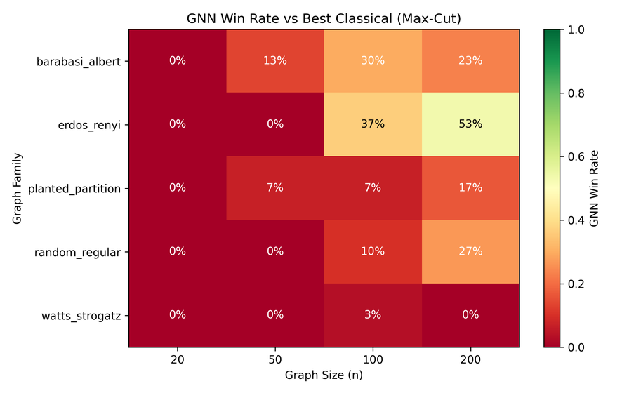
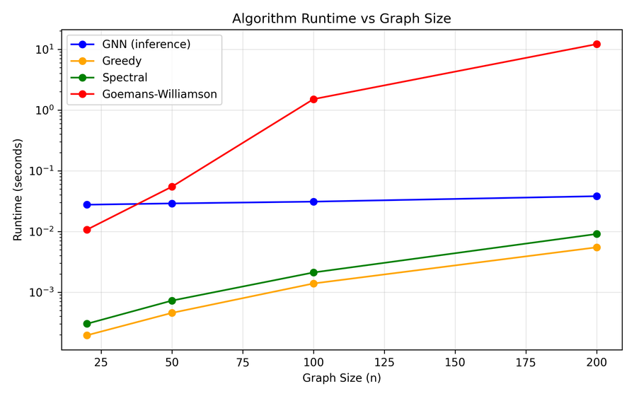
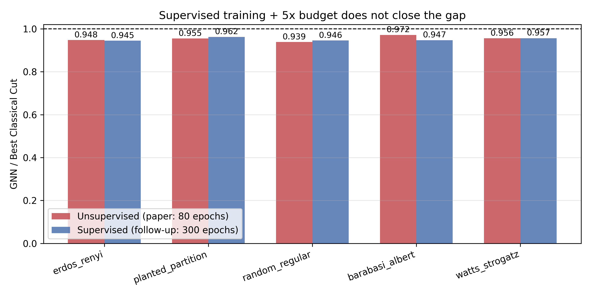

# GNNs vs. Proven Approximation Algorithms

[](https://github.com/zyx100089-eng/gnn-vs-classical/actions/workflows/tests.yml)
[](https://www.python.org)
[](LICENSE)

**The short version, in two halves.**

*First, an autopsy.* My original Max-Cut pipeline was a controlled way
to show where performance actually comes from: I gave the GNN a 1-opt
local search after inference that (mostly) no classical method got, and
a control found that a **coin flip plus that identical local search
scored within 1% of the "trained GNN" pipeline** — and the network's
raw output, without the search, was *worse than a coin flip* (it cut
21% of the edges; a coin flip cuts ~50%). There is a provable reason:
with the constant node features the code used, the training loss has an
exact critical point at the uniform output p=0.5, whose value is
precisely the random-cut baseline — and the network starts there.

*Then, the fix.* With three changes — symmetry-breaking **Laplacian
positional-encoding features**, a **best-of-50 Bernoulli decoding**
matching the rounding budget Goemans-Williamson gets, and an edge-count-
**normalised loss** with per-graph normalisation — the same 5-layer GIN
became a credible heuristic: against a **budget-matched** control
(best-of-50 coin flips + the same local search) it wins with mean ratio
1.038 (95% bootstrap CI [1.035, 1.041]), and it edges out the spectral
method (1.008, [1.006, 1.010]) — but it still loses to
**Goemans-Williamson** (0.987, [0.985, 0.988]), which, with or without
the local search, reaches the *exact* optimum on every instance we can
verify (n ≤ 20). About half of the network's apparent raw advantage
over a naive coin flip is just its 50-sample decoding budget, not
learning. On TSP the GNN still collapses to
nearest-neighbour. Predicting *when* the GNN wins is genuinely at
chance (LR balanced accuracy 0.54 ± 0.18).

I'm not reporting this because it's flattering. I'm reporting it
because the ablation is the interesting result — and it puts this repo
squarely in a live literature debate (Angelini & Ricci-Tersenghi 2023;
Boettcher 2023, critiquing Schuetz et al.'s PI-GNN): **much of what a
naive GNN pipeline appears to achieve comes from the classical
post-processing bolted onto it, not from the network.**

> **Full write-up:** [paper/main.pdf](paper/main.pdf) — a LaTeX paper
> with the complete methodology, results tables, and analysis
> (source: `paper/main.tex`).

## Where this came from

I kept reading papers claiming GNNs can *solve* NP-hard problems like
Max-Cut and TSP. Meanwhile, classical algorithms with real guarantees
have existed for decades — Goemans-Williamson gives you a cut within
0.878 of optimal, Christofides a tour within 1.5 of optimal. Nobody
seemed to be putting the two on equal footing. So I did.

The rules I set myself:

1. Implement the classical baselines **with their guarantees**, from
   scratch (no library calls hiding the hard part).
2. Train a GNN solver for each problem.
3. Run both on the same held-out instances across several graph
   families, report quality **and** runtime.
4. Ablate: give *every* method — including a coin flip — the same
   post-processing, so the comparison measures the right thing.



*Win rate of the fixed GNN against the best classical solver, per graph
family and size (from the Max-Cut comparison).*



*Solver runtime vs graph size: the GNN's one clear advantage is
inference speed. Note the caveat below — this is only measured where
the SDP actually runs, and it excludes training cost.*

## The results, honestly

| Problem | What happened |
|---|---|
| Max-Cut | Fixed GNN + shared local search: wins 68/600 (11.3%), ties 160 (26.7%), loses 372 — 38% match-or-beat; 98.6% of the best classical cut; beats the budget-matched coin-flip control (ratio 1.038) and spectral (1.008), loses to GW (0.987). GW refined finds the exact optimum on all verifiable instances. Goemans-Williamson dominates |
| TSP | GNN+2-opt ≈ NN+2-opt. Christofides+2-opt consistently wins. Trained GNN collapses to nearest-neighbour (embedding cosines all 1.0) |
| Coloring | GNN genuinely loses: 0 wins / 3 ties / 597 losses, using 15.4 colours on average vs DSatur's 5.4 — not a tie artefact |

## The caveats I have to state

- **The runtime comparison is not apples-to-apples by construction.**
  The GNN's `gnn_time` measures one inference (50 Bernoulli samples +
  local search) and excludes the training cost entirely (80 epochs over
  2000 graphs). GW's time is per-instance SDP solving with no
  amortisation across instances. If you solve many instances from a
  fixed distribution, the GNN's training cost amortises to zero; for a
  handful of instances it never pays for itself. There is a break-even
  number of instances below which the SDP is also the better time
  trade — I report the curves and let the reader place it.
- **The speed claim, scoped.** "GNN inference is faster than SDP" is
  only measured where SDP actually runs (n ≤ 200 in my experiments;
  above that, my SDP falls back to spectral relaxation with a warning).
  At the sizes where both run, SDP's runtime explodes and the GNN
  wins on speed — but I did not measure SDP at large n because it
  couldn't run. The committed timing columns are wall-clock means from
  one run on one machine and are not portable; treat them as ordering,
  not absolutes.
- **`sdp_bound` is a proxy, not a certificate.** The SDP relaxation's
  exact optimum upper-bounds every max cut; the committed value is the
  objective at the solver's (approximate, SCS) solution, so ratios to it
  are indicative only. The rigorous certificates are the brute-forced
  exact optima for n ≤ 20 (150 instances), where GW achieves ratio 1.000
  on every instance.
- **best_classical_cut is an oracle over baselines.** The headline
  "win vs the best classical algorithm" compares the GNN against
  max(greedy, spectral, GW) — an upward-biased oracle. The pairwise
  head-to-heads (GNN vs GW alone: mean ratio 0.987, still a loss) are
  in the stats output and the paper, and the conclusion survives the
  bias.
- **Ties count as losses in the win-rate convention.** `gnn_wins`
  uses a strict `>`; exact matches with the best classical cut are
  reported separately (`gnn_ties` column). For Max-Cut: 68 wins / 160
  ties / 372 losses. Both numbers are in the CSV.
- **Trained on one family, one seed per model — but multi-seed tested.**
  The GNN trains on Erdős–Rényi n=100 only; everything else is
  out-of-distribution. The committed canonical run is seed 42 on its own
  held-out benchmark (68/600 wins, 0.9861 relative to the best classical
  cut). The controlled seed spread re-scores all three models on a
  single common benchmark (`--eval_seed 1000`, beyond every training
  range, so no evaluation instance was seen in training): 51/44/40 wins
  (8.5%/7.3%/6.7%) at 0.985–0.987 relative. The same seed-42 model
  therefore scores 68 vs 51 wins on the two benchmarks while its
  relative quality is unchanged (0.9861 vs 0.9864; two-proportion
  $p = 0.10$) — the win count is a threshold statistic and the gap is
  sampling noise, not a favourable benchmark. Use `--seed` to change the
  trained model and `--eval_seed` (greater than every `--seed`) to fix
  the benchmark.
- **In-distribution vs out-of-distribution.** On the canonical run the
  GNN wins 36.7% of the in-distribution Erdős–Rényi n=100 slice versus
  the *best classical cut* (and 10.0% out-of-distribution), and reaches
  0.994 / 0.986 of it. The stats script reports a different, stricter
  denominator — win/tie/loss against *all twelve* methods including
  GW+LS — giving 10.0% / 1.6% wins; the two are labelled distinctly in
  its output.
- **Laplacian PE is not permutation-invariant under eigenvalue degeneracy.**
  The sign-canonicalisation fixes each eigenvector's global sign but not
  rotations within a repeated eigenspace, so on graphs with degenerate
  top eigenvalues (we measured random-regular n=20) the features --- and
  hence predictions --- can depend on node labelling. It does not affect
  the committed numbers (which use one fixed labelling) but is a real
  limitation of the feature scheme.
- **GNN speed is not a solution-quality advantage.** The GNN's only
  clear win is inference speed. It does not produce better solutions.

## The ablation: what actually does the work

Every method below runs on the same 600 held-out instances; every
method that wants the 1-opt local search gets the same one
(`run_maxcut_ablation.py`, full table in
`results/analysis/maxcut_ablation.csv`, statistics via
`run_maxcut_stats.py`).

| Method | mean cut / edges | wins / ties / losses vs all others |
|---|---|---|
| Coin flip, 1 sample, raw | 0.499 | 0.0% / 0.0% / 100.0% |
| Coin flip, 50 samples, raw | 0.588 | 0.0% / 0.0% / 100.0% |
| Coin flip, 1 sample + 1-opt LS | 0.715 | 0.2% / 5.8% / 94.0% |
| Coin flip, 50 samples + LS | 0.717 | 0.3% / 6.7% / 93.0% |
| Greedy (= coin flip + LS) | 0.712 | 0.0% / 4.8% / 95.2% |
| **GNN (original, broken), raw output** | **0.211** | — |
| GNN (original, broken) + LS | 0.722 | — |
| GNN (fixed), raw 50-sample output | 0.677 | 0.0% / 18.8% / 81.2% |
| **GNN (fixed) + LS (canonical)** | **0.745** | 2.0% / 25.5% / 72.5% |
| Spectral, no refinement | 0.685 | 0.0% / 6.0% / 94.0% |
| Spectral + its LS | 0.740 | 2.0% / 19.2% / 78.8% |
| Goemans-Williamson (50 roundings) | 0.755 | 0.0% / 51.7% / 48.3%* |
| GW + 1-opt LS | 0.758 | 38.7% / 55.3% / 6.0% |
| *SDP relaxation objective* | *0.790* | *(upper-bound proxy)* |
| *Exact optimum (n ≤ 20)* | *0.805* | *(150 instances)* |

\* GW's row loses only to GW+LS, which refines GW's own output — GW
can never "win" against a strictly-improved version of itself.

Reading it honestly:

- **In the original setup, the network was worse than nothing.** Its raw
  thresholded output cut 21% of edges — a coin flip cuts ~50%. The
  entire reported performance came from the local search. A coin flip
  + the same LS scored within 1% of the "trained GNN" pipeline (mean
  ratio 0.9895) and beat it on 30.8% of instances head-to-head. The
  broken run's results are preserved as `maxcut_comparison_broken.csv`
  and `maxcut_ablation_broken.csv` so this control is reproducible from
  committed artifacts.
- **The matched control (the important correction).** The GNN's decoder
  is best-of-50 samples, so its control must be too. A single coin flip
  gets 0.499 of edges; **best-of-50 coin flips gets 0.588**; the GNN's
  raw output gets 0.677. So of the 0.179-of-edges raw gap over a naive
  coin flip, **50% is the control's sample budget, not learning** — the
  network's own contribution is the remaining 0.089. With the local
  search on both sides the comparison is 0.745 vs 0.717 (mean ratio
  1.038 [1.035, 1.041], Wilcoxon p = 2×10⁻⁷⁰, GNN ahead on 82.2% of
  instances and tied on 9.0%). The conclusion survives, but only the
  budget-matched number is the honest one.
- **Why the original failed (provable):** the loss is quadratic around
  the uniform output. With constant node features, all-p=0.5 is an exact
  critical point whose value is exactly the random baseline, and
  message passing cannot distinguish nodes there. The epoch-1 loss of
  the original run sits on that baseline (within batch-sampling
  variation; log preserved as `maxcut_training_log_broken.csv`);
  80 epochs of cosine-annealed training crawled to 63% of edges and
  stopped. The committed diagnostic
  (`experiments/run_gnn_symmetry_diagnostics.py`) reproduces the
  mechanism: at all-p=0.5 the unnormalised loss is exactly −|E|/2 with
  zero gradient; a constant-feature GIN's output is near-constant across
  nodes (mean output std ≈ 0.02) and its thresholded partition is
  degenerate — empty or all-one-side — on about a third of sampled
  instances; and plain LayerNorm shrinks the across-node signal
  monotonically across the five layers, whereas per-graph GraphNorm
  keeps it roughly constant. (Any "cut" the degenerate case reports
  comes from the pipeline's node-0 guard, not from a partition.)
- **The fixes that worked:** Laplacian positional-encoding features
  (top-4 eigenvectors of L + normalised degree — smooth, survive
  aggregation, and tie the model to the spectral relaxation), an
  O(1)-scale head initialisation (the saddle has zero gradient, so a
  near-zero init stays there forever), best-of-50 Bernoulli decoding
  (the same rounding budget GW gets), an edge-count-normalised loss,
  and per-graph GraphNorm instead of BatchNorm.
- **After the fixes** the raw output is genuinely informative but
  budget-confounded: 0.677 vs the 50-sample coin flip's 0.588 (vs 0.499
  for one sample), so half the apparent raw gain is decoding budget.
  With the shared local search the GNN beats the matched control and
  spectral with CIs excluding 1.0, and still loses to GW by 1.3%
  (CI [0.985, 0.988]). **GW refined with the same local search dominates
  everything (38.7% outright wins)** and hits the exact optimum on every
  instance we can brute-force.
- This is the same failure mode Angelini & Ricci-Tersenghi and
  Boettcher documented for Schuetz et al.'s PI-GNN: a learned pipeline
  whose apparent quality is largely the classical post-processing
  underneath it.

## Corrections from a post-publication audit

Two rounds. Round 1 fixed reporting and protocol; round 2 (an ablation
audit) found the model itself was broken and rebuilt it.

### Round 1 — reporting and protocol

1. **"52 positives" was a typo.** The failure-prediction caveat had
   said 52 positives out of 600; in the original run the correct number
   was 11 (1.8%). (The rebuilt run has 68 positives, 11.3% — a different
   "11" and a different model; don't conflate the two.)
2. **Ties are now reported, not folded away.** Strict-`>` win rates
   silently counted exact ties as losses; `gnn_ties` columns and
   three-way breakdowns are reported everywhere.
3. **Evaluation seeds overlapped the training seed range** (seeds 42
   and 1042 were literally seen in training). All runners now offset
   evaluation seeds by `max(--seed, --eval_seed) + train_graphs`, so
   they clear the training range of *whichever* seed is used, and the
   artifacts were regenerated under the fixed runners. (When varying
   `--seed` for the multi-seed spread, pass a common `--eval_seed`
   greater than every training seed — the committed spread uses 1000 —
   so all runs also share one benchmark.)
4. **A `gw_fallback` column records whether GW was really GW** (the
   SDP-status fallback now emits a warning and is logged; none fired).
5. **Failure prediction scales inside CV folds** (scaler fitted within
   a `Pipeline`, per fold).
6. **The trained Max-Cut model is committed** (`maxcut_gnn_weights.pt`),
   so the headline result can be reproduced and inspected directly.

### Round 2 — the ablation audit (this rewrite)

7. **The original GNN pipeline was a coin flip in disguise.** A
   random-init control with the identical local search matched the
   "trained GNN" within 1%, and the raw network output was worse than a
   coin flip (0.21 vs ~0.50 of edges cut). Root cause: an exact
   critical point of the loss at the uniform output with constant node
   features. Documented as the negative control above.
8. **The model was rebuilt** with symmetry-breaking Laplacian
   positional-encoding features, O(1) logit initialisation,
   best-of-50 Bernoulli decoding, edge-count-normalised loss, and
   per-graph GraphNorm, then retrained on three seeds with a held-out
   validation split and checkpoint selection. The fixed model beats the
   budget-matched coin-flip control (1.038 [1.035, 1.041]) and the spectral method
   (1.008 [1.006, 1.010]), and still loses to Goemans-Williamson
   (0.987 [0.985, 0.988]).
9. **Headline metrics changed.** The win rate alone is the wrong
   headline; every comparison is now reported as win/tie/loss plus
   mean approximation ratios with paired-bootstrap CIs and Wilcoxon
   signed-rank tests, split in-distribution vs out-of-distribution
   (`run_maxcut_stats.py`).

## Algorithms implemented

### Classical (with guarantees)

| Algorithm | Problem | Guarantee |
|-----------|---------|-----------|
| Random partition | Max-Cut | ≥ 0.5·OPT |
| Greedy local search | Max-Cut | ≥ 0.5·OPT |
| Spectral relaxation | Max-Cut | Based on λ_max(L) |
| **Goemans-Williamson** | Max-Cut | **≥ 0.878·OPT** |
| Nearest Neighbour | TSP | O(log n)·OPT |
| **Christofides** | TSP | **≤ 1.5·OPT** |
| 2-opt local search | TSP | No guarantee |
| Greedy / Welsh-Powell | Coloring | ≤ Δ+1 colors |
| **DSatur** | Coloring | **Optimal on bipartite** |

### Learned (no guarantees)

| Algorithm | Problem | Architecture |
|-----------|---------|-------------|
| GIN (unsupervised) | Max-Cut | 5-layer GIN + local search |
| GIN (REINFORCE) | TSP | 5-layer GIN + policy gradient + greedy + 2-opt |
| GIN (classification) | Coloring | 5-layer GIN + conflict repair |

## Project structure

```
src/
├── graphs/              # 6 graph family generators + spectral properties
├── classical/
│   ├── maxcut/          # Random, Greedy, Spectral, Goemans-Williamson
│   ├── tsp/             # Nearest Neighbor, Christofides, 2-opt
│   └── coloring/        # Greedy, Welsh-Powell, DSatur
├── gnn/
│   ├── models/          # GIN for Max-Cut, TSP, and Coloring
│   └── training/        # Training loops (incl. REINFORCE)
├── evaluation/          # Metrics, timing, solution comparison
└── analysis/            # Failure prediction (balanced metrics)
experiments/             # Reproducible experiment runners
tests/                   # 27 tests (classical algorithms; no torch needed)
paper/                   # LaTeX write-up
```

## Running it

```bash
python3 -m venv .venv && source .venv/bin/activate
pip install -r requirements.txt

python3 -m pytest tests/ -v

python3 experiments/run_maxcut_comparison.py
python3 experiments/run_tsp_comparison.py
python3 experiments/run_coloring_comparison.py
python3 experiments/run_failure_analysis.py
```

## How to verify my work

Every headline number maps to a committed artifact. Cheapest first:

```bash
# 1. The 27 tests (fast, no GPU): classical-algorithm guarantees and
#    evaluation metrics (they do not exercise the learned components)
python3 -m pytest tests/ -v

# 2. The headline numbers live in committed artifacts — check directly
python3 - <<'EOF'
import json, pandas as pd
df = pd.read_csv("results/analysis/maxcut_comparison.csv")
print("GNN win rate:", f"{df['gnn_wins'].mean():.1%}")      # expect 11.3%
print("GNN ties:", int((df["gnn_cut"] == df["best_classical_cut"]).sum()))  # expect 160
print("GNN mean cut / best cut:", round(df["gnn_cut"].mean() /
      df["best_classical_cut"].mean(), 3))                  # expect ~0.991
ab = pd.read_csv("results/analysis/maxcut_ablation.csv")
import numpy as np
print("GNN raw (no LS) mean cut/edges:",
      round((ab["gnn_nols"]/ab["m"]).mean(), 3))            # expect ~0.677
print("50-sample coin flip, raw:",
      round((ab["rand50_nols"]/ab["m"]).mean(), 3))         # expect ~0.588
print("GNN+LS / 50-sample-coin-flip+LS ratio:",
      round((ab["gnn_ls"]/ab["rand50_ls"]).mean(), 3))      # expect ~1.038
# the negative control, from the preserved broken run:
b = pd.read_csv("results/analysis/maxcut_comparison_broken.csv")
bm = b[["family","n","instance","gnn_cut"]].merge(
     ab[["family","n","instance","rand_ls"]], on=["family","n","instance"])
print("coin-flip+LS / broken GNN+LS mean ratio:", round((bm["rand_ls"]/bm["gnn_cut"]).mean(), 3))
                                                            # expect ~0.990 (the headline)
j = json.load(open("analysis/figures/failure_prediction/prediction_results.json"))
print("balanced acc:", round(j["lr_balanced_accuracy"], 2)) # expect 0.54
print("balanced acc std:", round(j["lr_balanced_accuracy_std"], 2)) # expect 0.18
EOF
```

| Headline claim | Artifact |
|---|---|
| GNN wins 11.3% of 600 Max-Cut instances (fixed model) | `results/analysis/maxcut_comparison.csv` (column `gnn_wins`) |
| The refinement, not the network, did the original work | `results/analysis/maxcut_ablation.csv` (`gnn_nols`, `rand_ls`, `rand_nols`) |
| Fixed GNN beats coin-flip control / spectral, loses to GW | `python3 experiments/run_maxcut_stats.py` (ratios, CIs, Wilcoxon) |
| GW + local search finds the exact optimum (n ≤ 20) | `results/analysis/maxcut_ablation.csv` (`gw_plus_ls`/`exact_opt`) |
| TSP GNN collapses to nearest-neighbour | `results/analysis/tsp_gnn_weights.pt` + `tsp_comparison.csv` (embedding-cosine analysis in the paper) |
| DSatur beats GNN on coloring | `results/analysis/coloring_comparison.csv` |
| Failure prediction at chance (balanced acc 0.54) | `analysis/figures/failure_prediction/prediction_results.json` |
| Follow-up: supervised + 5× budget still loses (0.9%) | `results/analysis/supervised_maxcut_comparison.csv` |

To regenerate any artifact, run the corresponding step in
[Reproducing the paper](#reproducing-the-paper) — every experiment
trains its own GNN and evaluates on fresh held-out instances.

## Reproducing the paper

Everything in `paper/main.pdf` is reproducible from the committed
code and results. In order:

```bash
# 1. Environment
python3 -m venv .venv && source .venv/bin/activate
pip install -r requirements.txt

# 2. Tests first (27 tests: classical guarantees + metrics; no torch needed)
python3 -m pytest tests/ -v

# 2b. Follow-up experiment (supervised GNN, 5x budget) — optional, ~30 min
python3 experiments/run_supervised_maxcut.py
python3 experiments/make_followup_figure.py

# 3. Re-run the three comparisons (each trains a GNN, then evaluates
#    on held-out instances across all graph families; results land in
#    results/analysis/*.csv)
python3 experiments/run_maxcut_comparison.py
python3 experiments/run_tsp_comparison.py
python3 experiments/run_coloring_comparison.py

# 3b. Multi-seed spread (optional): vary the training seed but keep the
#     evaluation benchmark fixed with a common --eval_seed that is larger
#     than every --seed, so the spread is model variance (not benchmark
#     variance) and no eval seed lands in any training range. --out also
#     tags the weights/log files (…_seed43.pt/.csv), so the canonical
#     model is not overwritten.
python3 experiments/run_maxcut_comparison.py --seed 42 --eval_seed 1000 --out maxcut_comparison_seed42.csv
python3 experiments/run_maxcut_comparison.py --seed 43 --eval_seed 1000 --out maxcut_comparison_seed43.csv
python3 experiments/run_maxcut_comparison.py --seed 44 --eval_seed 1000 --out maxcut_comparison_seed44.csv
#    (or re-score already-trained weights on the same benchmark:
#     python3 experiments/run_maxcut_comparison.py --eval_only \
#         --eval_seed 1000 --weights results/analysis/maxcut_gnn_weights_seed43.pt \
#         --out maxcut_comparison_seed43.csv)

# 4. Ablation study (controls, SDP bounds, exact optima for n<=20;
#    needs results/analysis/maxcut_comparison.csv + the committed
#    maxcut_gnn_weights.pt) and its statistics
python3 experiments/run_maxcut_ablation.py   # ~15 min
python3 experiments/run_maxcut_stats.py

# 5. Failure-prediction analysis (reads the Max-Cut results CSV)
python3 experiments/run_failure_analysis.py

# 6. Symmetry diagnostics (saddle check, feature collapse) and the
#    downscaled README figures
python3 experiments/run_gnn_symmetry_diagnostics.py
python3 experiments/make_docs_figures.py

# 7. Rebuild the paper (LaTeX source in paper/main.tex)
tectonic paper/main.tex   # or: pdflatex paper/main.tex
```

The committed `results/analysis/*.csv` files are the outputs of steps
3–5 as run for the paper, so the figures and tables can be reproduced
without re-running the experiments. The Max-Cut and TSP GNN weights are
committed (`results/analysis/maxcut_gnn_weights.pt`,
`results/analysis/tsp_gnn_weights.pt`) so both headline results can be
reproduced and inspected directly.

## The maths behind the guarantees

**Goemans-Williamson (Max-Cut):** relax the integer program to an SDP
over PSD matrices, round via random hyperplanes. The 0.878 guarantee
comes from E[cut] = Σ w_ij·arccos(v_i·v_j)/π. (Falls back to spectral
with a warning when the SDP solver fails or n > max_n — and the
fallback is recorded in a `gw_fallback` column of the results CSV.)

**Christofides (TSP):** MST ≤ OPT (a lower bound minus one edge), min
matching on odd vertices ≤ 0.5·OPT, combined ≤ 1.5·OPT.

**REINFORCE (TSP GNN):** the GNN produces node embeddings; a stochastic
policy samples the next city from softmax(embedding_similarity /
distance / temperature); the log-probability of the sampled tour times
the advantage gives the policy gradient. This is a proper policy
gradient — the log-probability comes from the actual stochastic
choices, not detached.

**DSatur (Coloring):** saturation-based vertex ordering produces
optimal 2-colorings on bipartite graphs and near-optimal colorings on
structured graphs.

## Follow-up: supervised training + 5x budget

The paper's conclusion ("the GNN loses, and the loss is not a training
artefact") is only as strong as the training it was based on. This
follow-up answers the two caveats above directly:

1. **Supervised labels** from the spectral relaxation (a strong,
   cheap teacher that achieves ~97.8% of the best classical cut),
   instead of the original unsupervised cut-maximisation loss.
2. **5× the training budget**: 300 epochs (vs 80), plus cosine LR
   decay — the paper itself called the 80-epoch budget "modest".

The follow-up evaluates held-out instances across five graph families
and three sizes (n = 20/50/100, 30 instances each = 450 instances), vs
random, greedy, spectral, and Goemans-Williamson. For the comparator
row below, the paper's Max-Cut results are restricted to the same
three sizes so the two rows cover the same protocol.



| Setting | Win rate | GNN / best classical |
|---|---|---|
| Unsupervised (rebuilt, n ≤ 100) | 32/450 = 7.1% | 0.984 |
| **Supervised, 300 epochs (follow-up)** | **4/450 = 0.9%** | **0.963** |

**The conclusion holds — and then some.** A supervised training signal
and a 5× budget do not close the gap: on the same 450-instance protocol
the supervised model is *worse* (0.963 vs 0.984 relative; 0.9% vs 7.1%
wins). Fitting the spectral-relaxation labels directly makes the
network imitate that teacher rather than maximise the cut, and the
imitation is no better than the teacher's own thresholded partition —
so the learned component still adds nothing over the classical method
it was trained to copy. Part of the shortfall is a target artefact: a
partition and its complement are the same cut, but the BCE target fixes
one arbitrary orientation, so a model that outputs the equivalent
flipped partition is penalised. This is the standard reason a supervised
Max-Cut model can underperform, and it is a second reason not to read
the 0.963 as a clean statement about supervision in general. The result
is still consistent with the paper's failure-prediction finding: the
GNN's rare wins are not a recoverable signal.

Reproduce with:

```bash
python3 experiments/run_supervised_maxcut.py          # train + evaluate (~30 min)
python3 experiments/make_followup_figure.py           # figure above
```

Results: `results/analysis/supervised_maxcut_comparison.csv`,
training log `results/analysis/supervised_maxcut_training_log.csv`,
weights `results/analysis/supervised_maxcut_gnn_weights.pt`.

## What I'd do next

- Give the GNN a genuinely large training budget (1000+ epochs,
  bigger architecture) with an exact solver as an upper-bound
  reference — I've done the 5× version; the 10× version would
  settle the question more completely.
- Try a supervised Max-Cut baseline with a different label source
  (e.g. exact solutions on small graphs).
- Run SDP at n up to the solver's real limit instead of a fixed
  max_n, and measure the fallback's effect on the speed comparison.
- Add Gurobi / exact solvers as an upper bound reference.

## What surprised me

The TSP collapse. I expected the GNN's learned embeddings to at least
give 2-opt a better starting point than nearest-neighbour. Instead,
after training, every pairwise embedding cosine was 1.0 — the GNN
learned to produce identical embeddings for all nodes. 2-opt then
erased even that. It was the cleanest "the model learned nothing
useful" result I've seen, and it's exactly why the comparison had to
be empirical.
